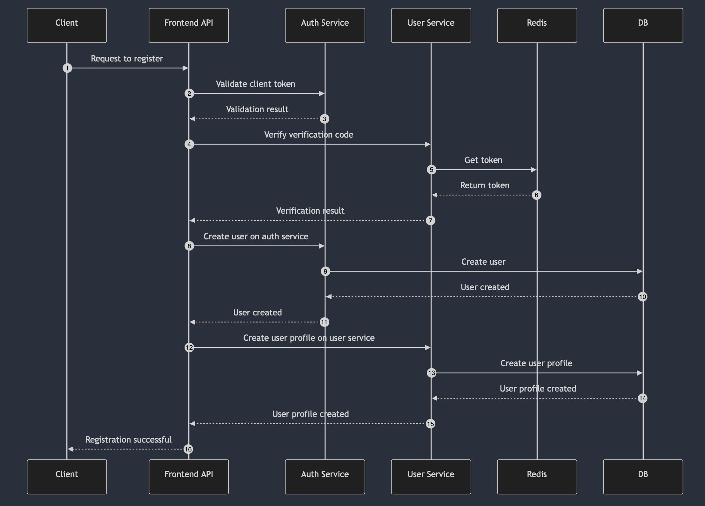
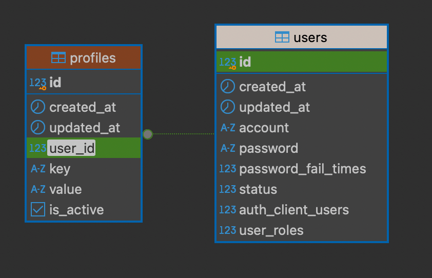

# User Service

## Introduction

負責用戶功能的服務。正式環境下應只對內部群集開放。使用gRPC作為服務間的通訊協定

與驗證授權服務(Auth Service)分離。

## 目錄結構

``` sh
.
├── README.md
├── application
│   └── user_service.go
├── config
│   └── config.go
├── doc
├── domain
│   ├── aggregate
│   ├── entity
│   ├── repository
│   └── service
├── infrastructure
│   ├── grpc_impl
│   │   └── server.go
│   └── repo_impl
├── main.go
└── migrations
```

說明:

- root: 會有一個`main.go`當作服務的啟動點, `.env` 或 `docker-compose.yaml`...與專案無直接相關的檔案先放在跟資料夾下。是否要將build相關的檔案另開資料夾，可以討論
- /application: domain層對外溝通的實現放在這裡。如具體實現gprc service接口、dto。
- /config: 放置config檔相關文件
- /doc: openapi或相關文件都放這裡
- /domain: 業務邏輯的核心所在
- /infrastructure: 基礎設施
- /migrations: db相關版本計畫放這裡
  
## API使用流程

### 註冊

前置流程如下，

- 客戶端申請驗證碼
- 客戶端將註冊資訊與驗證碼一同寄回

接著如下圖

(1): 客戶端向`Frontend API`請求註冊

(2-4): `Frontend API`向`user_service`檢查驗證碼

(5-7): `auth_service`從redis讀取驗證碼，成功則刪除該驗證碼session

(8-11): `Frontend API`向`auth_service`創建使用者

(12-15): `Frontend API`向`user_service`創建使用者資訊



## 資料庫設計

### 使用者資訊 (Profile)

該表使用鍵值對方式紀錄，以利欄位擴展、一對多關係，缺點是非正則化且對一對一的查詢、管理成本提高

並透過`user_id`與`auth.public.users`的`id`關聯

可使用的鍵(key)會在`/pkg/enum/profile_key.go`


